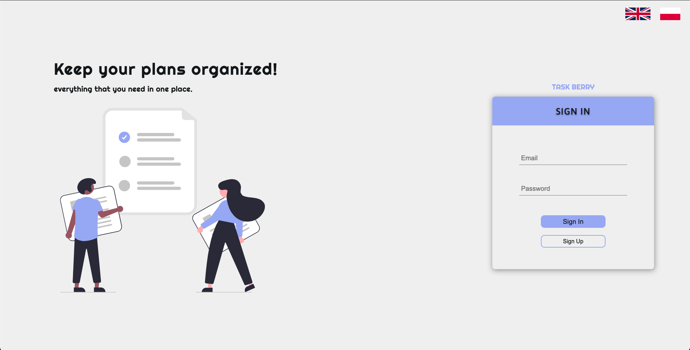
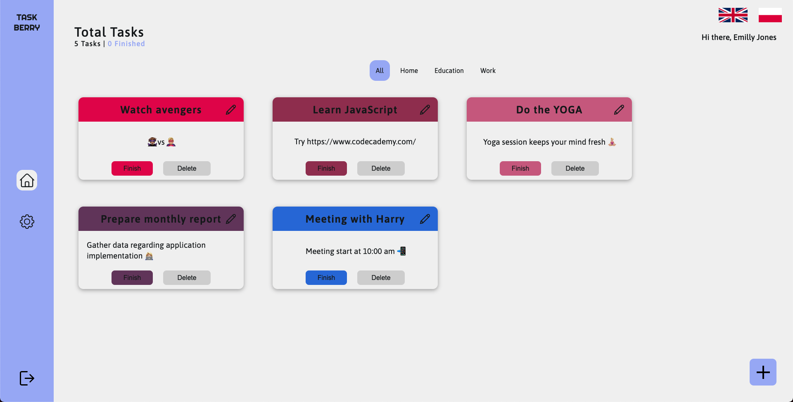

# Task Berry

App is a task managment service.
Live version is available at **[Task Berry](https://task-berry.vercel.app/)**

```
prepared user:
  - email: emilly.jones@google.com
  - password: Hello321!
```

The API demo is hosted on a free `render` plan (sleepy one), so the first request will take around 30 seconds (it needs to wake up).





## Usage

```bash
yarn install # installs dependecies
yarn start # compiles and hot-reloads for development
yarn build # compiles and minifies for production
yarn lint # lints files
yarn lint:fix # lints and fixes files
```

## Tech Stack
- React + TypeScript
- Redux Toolkit
- StyledComponents
- Gsap
- i18n
- Axios

## Authors
- [Me](https://github.com/hoolek77)
